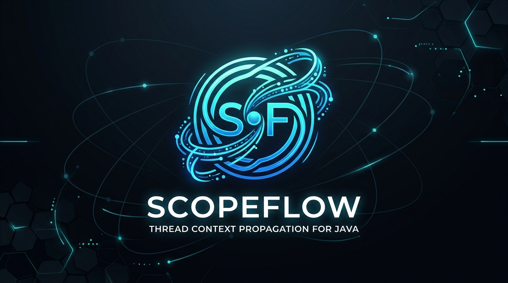

<p align="center">
  
</p>

# ScopeFlow

**The simplest way to propagate context, logging and tracing in Java 21+ with Spring and virtual threads.**

[](LICENSE)
[](https://openjdk.org/jeps/444)
[](https://github.com/FrodyGr/scopeflow/actions)
[](https://central.sonatype.com/artifact/io.github.frodygr/scopeflow-bom)

---

## What is ScopeFlow?

ScopeFlow is an open-source library that simplifies **execution context propagation** across technical and business layers in modern Java applications. It bridges the gap between logging (MDC), observability (Micrometer, OpenTelemetry), and modern concurrency (virtual threads, `ScopedValue`).

### The Problem

```java
MDC.put("request.id", "abc-123");
executor.submit(() -> {
    MDC.get("request.id"); // null! Context is lost across threads.
});
```

### The Solution

```java
try (Scope scope = scopeFlow.open("request", Map.of("request.id", "abc-123"))) {
    executor.submit(scopeFlow.wrap(() -> {
        MDC.get("request.id"); // "abc-123" — context travels automatically!
    }));
}
```

ScopeFlow provides a single **scope-based abstraction** that:

- ✅ Creates, enriches, and closes context scopes via `try-with-resources`
- ✅ Auto-propagates to **SLF4J MDC** for correlated logging
- ✅ Wraps tasks for **cross-thread context propagation**
- ✅ Integrates with **Spring Boot** via a zero-config starter
- ✅ Bridges to **Micrometer** (Reactor) and **OpenTelemetry** (Baggage)
- ✅ Supports **virtual threads** out of the box
- ✅ Provides **ScopedValue** & **StructuredTaskScope** integration (Java 23+ preview)

---

## Quick Start

### Spring Boot (recommended — zero config)

```xml
<dependency>
    <groupId>io.github.frodygr</groupId>
    <artifactId>scopeflow-spring-boot-starter</artifactId>
    <version>0.1.0</version>
</dependency>
```

```java
@RestController
public class OrderController {

    @Autowired
    private ScopeFlow scopeFlow;

    @PostMapping("/orders")
    public Order createOrder(@RequestBody OrderRequest req) {
        // MVC interceptor already opened a scope with request.id, http.method, http.path

        try (Scope scope = scopeFlow.open("order.create",
                Map.of("customer.id", req.customerId()))) {

            log.info("Creating order");
            // Log: [req=abc-123] [customer.id=CUST-1] Creating order

            return orderService.create(req);
        }
    }
}
```

### Standalone (no Spring)

```xml
<dependency>
    <groupId>io.github.frodygr</groupId>
    <artifactId>scopeflow-core</artifactId>
    <version>0.1.0</version>
</dependency>
<dependency>
    <groupId>io.github.frodygr</groupId>
    <artifactId>scopeflow-mdc</artifactId>
    <version>0.1.0</version>
</dependency>
```

```java
ScopeFlow scopeFlow = ScopeFlowBuilder.create()
    .propagator(new MdcPropagator(MdcKeyPolicy.allowAll()))
    .build();

try (Scope scope = scopeFlow.open("order.process",
        Map.of("order.id", "ORD-123"))) {
    log.info("Processing");  // MDC has order.id=ORD-123
    executor.submit(scopeFlow.wrap(() -> {
        log.info("Async work");  // MDC still has order.id=ORD-123!
    }));
}
```

### Via JitPack (from GitHub)

```xml
<repositories>
    <repository>
        <id>jitpack.io</id>
        <url>https://jitpack.io</url>
    </repository>
</repositories>

<dependency>
    <groupId>com.github.FrodyGr</groupId>
    <artifactId>scopeflow-spring-boot-starter</artifactId>
    <version>v0.1.0</version>
</dependency>
```

---

## Modules

| Module | Description | Status |
|--------|-------------|--------|
| `scopeflow-core` | Core API, scope lifecycle, context wrappers | ✅ Ready |
| `scopeflow-mdc` | SLF4J MDC bridge with save/restore stack | ✅ Ready |
| `scopeflow-micrometer` | Micrometer Context Propagation (Reactor) | ✅ Ready |
| `scopeflow-otel` | OpenTelemetry Baggage bridge | ✅ Ready |
| `scopeflow-scoped` | ScopedValue + StructuredTaskScope (Java 23+ preview) | ✅ Ready |
| `scopeflow-spring-boot-autoconfigure` | Spring Boot auto-configuration | ✅ Ready |
| `scopeflow-spring-boot-starter` | Single-dependency starter | ✅ Ready |
| `scopeflow-bom` | Bill of Materials (version alignment) | ✅ Ready |

---

## Key Features

### Scope Nesting

Scopes nest naturally. Child scopes inherit parent values and restore them on close:

```java
try (Scope request = scopeFlow.open("http.request",
        Map.of("request.id", "abc-123"))) {

    try (Scope order = scopeFlow.open("order.process",
            Map.of("order.id", "ORD-456"))) {
        // context has both request.id and order.id
    }
    // only request.id remains
}
// context is empty
```

### Cross-Thread Propagation

```java
// Wrap individual tasks
executor.submit(scopeFlow.wrap(() -> { /* context here */ }));

// Or wrap the entire executor
ExecutorService wrapped = scopeFlow.wrapExecutorService(executor);
wrapped.submit(() -> { /* context here too */ });
```

### Spring Boot @Async (automatic)

```java
@Async
public void sendEmail(String orderId) {
    log.info("Sending email");  // MDC has request.id from the calling thread
}
```

### OpenTelemetry Baggage

```java
ScopeFlow scopeFlow = ScopeFlowBuilder.create()
    .propagator(new MdcPropagator(MdcKeyPolicy.allowAll()))
    .propagator(OtelBaggagePropagator.create())
    .build();
// Context entries automatically added to OTel Baggage
```

### Structured Concurrency (Java 23+ preview)

```java
List<String> results = ScopeFlowScoped.executeAll(scopeFlow, List.of(
    () -> fetchFromServiceA(),  // context propagated
    () -> fetchFromServiceB(),  // context propagated
    () -> fetchFromServiceC()   // context propagated
));
```

### Key Policies

```java
// Block sensitive data from ever entering context
ScopeFlowBuilder.create()
    .keyPolicy(ContextKeyPolicy.denyList(Set.of("password", "token")))
    .build();
```

---

## Spring Boot Auto-Configuration

With the starter, the following happens automatically:

| Feature | What it does |
|---------|-------------|
| **Request scope** | Opens `http.request` scope per HTTP request with `request.id`, `http.method`, `http.path` |
| **Request ID** | Generates UUID or reads from `X-Request-ID` header |
| **MDC** | All context keys flow to SLF4J MDC for correlated logs |
| **@Async** | `ScopeFlowTaskDecorator` propagates context to async tasks |
| **Virtual threads** | Works with `spring.threads.virtual.enabled=true` |

### Configuration

```properties
# Filter which keys go to MDC (recommended for production)
scopeflow.mdc.keys=request.id,tenant.id,user.id

# Custom request ID header
scopeflow.http.server.request-id-header=X-Correlation-ID

# Disable features
scopeflow.mdc.enabled=false
scopeflow.http.server.generate-request-scope=false
```

---

## Documentation

📖 Full documentation available in [`docs/wiki/`](docs/wiki/HOME.md):

- [Getting Started](docs/wiki/Getting-Started.md)
- [Core Concepts](docs/wiki/Core-Concepts.md)
- [Spring Boot Integration](docs/wiki/Spring-Boot-Integration.md)
- [Context Propagation](docs/wiki/Context-Propagation.md)
- [MDC Logging](docs/wiki/MDC-Logging.md)
- [Micrometer Integration](docs/wiki/Micrometer-Integration.md)
- [OpenTelemetry Integration](docs/wiki/OpenTelemetry-Integration.md)
- [ScopedValue & StructuredTaskScope](docs/wiki/ScopedValue-Preview.md)
- [Configuration Reference](docs/wiki/Configuration-Reference.md)
- [Best Practices](docs/wiki/Best-Practices.md)

---

## Requirements

- **Java 21+** (Java 23+ for `scopeflow-scoped` module)
- **SLF4J 2.x** (for MDC module)
- **Spring Boot 3.2+** (for starter)

---

## Building from Source

```bash
mvn clean verify
# 96 tests, 11 modules, ~8 seconds
```

---

## License

[Apache License 2.0](LICENSE)
